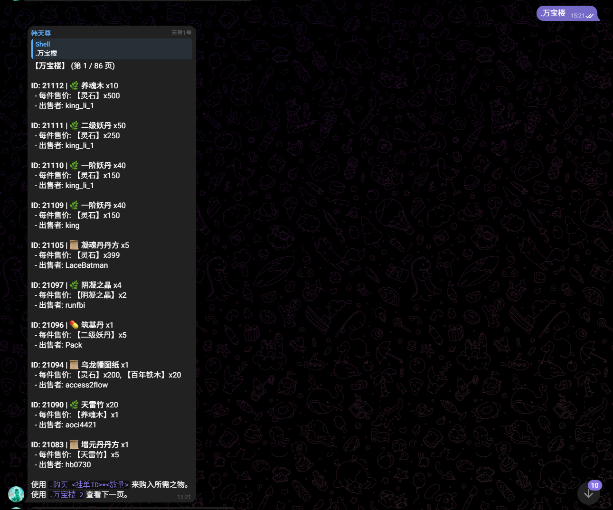

重生之凡人修仙·多人文字游戏数值体系设计文档
一、设计总纲
1.1 设计目标
本数值体系专为多人在线文字游戏设计，核心原则：

公平性：同境界修士数值可预测，战斗结果由策略决定（功法克制、属性相克），而非单纯数值碾压

平衡性：各流派（剑修/法修/体修/丹修/阵修）各有优劣，边际收益递减，避免单一最优解

可扩展性：从炼气到道祖，等比递增，后续内容可无缝接入

数据透明性：玩家可通过公开公式计算自身战力，便于策略规划

名	值	说明
境界基础倍率 BASE_RATE	2.0	每大境界基础属性翻倍
小境界递增倍率 SMALL_RATE	1.06	初期→中期→后期→圆满递增
基础生命系数 HP_COEFF	100	生命基数
基础攻击系数 ATK_COEFF	50	攻击基数
基础防御系数 DEF_COEFF	20	防御基数
基础突破率 BASE_BREAK	10%	基标准突破率（通过道具等物品提升概率）

二、核心属性体系
基础属性（先天属性）

属性	ID	    	作用	初始范围
根骨	bone	决定气血上限、气血回复速度、物理防御	3~15
神识	spirit	决定法力上限、法力回复速度、法术伤害、施法成功率	3~15
悟性	intel	决定修炼速度、功法领悟成功率、炼丹炼器成功率	3~15
体魄	str	    决定体力上限、近战伤害、负重	3~15
灵觉	percep	决定闪避率、暴击率、探测隐藏/阵法发现率	3~15
机缘	luck	影响随机事件触发率、掉落品质、奇遇概率	1~10（独立）
设计说明：机缘独立于35点之外，创建时随机1~10，不可分配。参考IM-Mortal的属性体系，在此基础上简化了经脉、魅力等次要属性，将核心属性浓缩至6项，便于玩家快速理解。

战斗属性（衍生属性）
由基础属性 + 境界 + 装备/功法加权计算得出。

属性	ID	计算公式	说明
气血	hp	<100 × 2^境界 × 1.06^小境界> + 根骨×20 + 体魄×10	归零=死亡
法力	mp	<50 × 2^境界 × 1.06^小境界> + 神识×15 + 根骨×5	施法消耗
体力	stamina	<50 × 2^境界 × 1.06^小境界> + 体魄×20	移动/战斗消耗
物理攻击	atk	<5 × 2^境界 × 1.06^小境界> + 体魄×3 + 根骨×1	近战/物理伤害基础
法术攻击	matk	<5 × 2^境界 × 1.06^小境界> + 神识×4	法术伤害基础
物理防御	def	<2 × 2^境界 × 1.06^小境界> + 根骨×2 + 体魄×1	减免物理伤害
法术防御	mdef	<2 × 2^境界 × 1.06^小境界> + 神识×2 + 根骨×1	减免法术伤害
速度	speed	10 + 灵觉×1.5 + (境界-1)×5	决定出手顺序
闪避率	dodge	min(灵觉×1.5% + 境界×2%, 60%)	上限60%

伤害计算公式
速度高者先手，每回合重新计算.
物理伤害：
物理伤害 = 攻击方物理攻击 - 防御方物理防御
法术伤害：
法术伤害 = 攻击方法术攻击 - 防御方法术防御

境界编码对照：
境界	编码	修为经验需求	基础突破概率	基础事件编号
凡人    	1	0	100%	1
炼气初期	2	100	90%	1
炼气中期	3	500	80%	1
炼气后期	4	1000	70%	1
炼气圆满	5	3000	60%	1
筑基初期	6	4000	50%	1
筑基中期	7	6000	40%	1
筑基后期	8	8000	30%	1
筑基圆满	9	10000	20%	1
金丹初期	10	12000	20%	1
金丹中期	11	14000	20%	1
金丹后期	12	16000	20%	1
金丹圆满	13	18000	20%	1
元婴初期	14	20000	20%	1
元婴中期	15	22000	20%	1
元婴后期	16	24000	20%	1
元婴圆满	17	26000	20%	1
化神初期	18	28000	20%	1
化神中期	19	30000	20%	1
化神后期	20	32000	20%	1
化神圆满	21	34000	20%	1
炼虚初期	22	36000	20%	1
炼虚中期	23	38000	20%	1
炼虚后期	24	40000	20%	1
炼虚圆满	25	42000	20%	1
合体初期	26	44000	20%	1
合体中期	27	46000	20%	1
合体后期	28	48000	20%	1
合体圆满	29	50000	20%	1
大乘初期	30	52000	20%	1
大乘中期	31	54000	20%	1
大乘后期	32	56000	20%	1
大乘圆满	33	58000	20%	1
渡劫初期	34	60000	20%	1
渡劫中期	35	62000	20%	1
渡劫后期	36	64000	20%	1
渡劫圆满	37	66000	20%	1
真仙    	38	68000	10%	1
金仙    	39	70000	10%	1
太乙金仙	40	72000	10%	1
大罗金仙	41	74000	10%	1
仙王    	42	76000	10%	1
仙帝    	43	78000	10%	1

## 功能设计(指令)
[] 表示可选参数或选项。
<> 表示必选参数或占位符。
... 表示可变参数或多个。

<闭关修炼>：主动进行修炼，获取大量修为点数。境界越高，基础收益越大。但闭关有成功、失败、走火入魔 三种可能，且有随机时长的冷却（约 10-30 分钟 ）。闭关时有几率触发奇遇。
闭关成功(概率60%)随机获得当前境界升级所需修为的1‰-1‰。闭关失败(概率25%)扣除当前境界升级所需修为的1‰-1‰。走火入魔(概率15%)扣除当前境界升级所需修为的1‰。需要可以在后台管理编辑概率和奇遇

返回结果示例:
【闭关成功】
@Shell_DFG福至心灵，成功炼化灵气，基础修为增加了47点。
本次闭关，你的修为最终增加了47点。
【奇遇】一道流光砸在你的洞府门前，竟是一块天外陨石，你从中提炼出了【金精矿】x1！
当前境界：炼气一层
当前修为：47/炼气初期
你感到一阵疲惫，需要打坐调息30分钟方可再次闭关。

<服用> <丹药名> <数量>: 使用储物袋中的丹药。
境界壁垒 : 丹药有服用境界限制，低阶修士无法承受高阶丹药的药力。
丹毒 : 24 小时内连续服用同类丹药会积累丹毒，影响闭关收益和炼制成功率。可使用 **【清灵丹】** 清除，或随时间缓慢消解。

后台管理界面添加个日志的记录,记录玩家每次的发言,包括发言内容,发言时间,发言人,发言境界,发言修为等。分页查询,每页显示100条记录,可以点击排序,默认按发言时间降序排序。需要模糊查询功能。

<排行榜>:查询玩家境界修为;玩家发言次数;玩家财富值等排行

被动增长 :
在群内有效发言，会自动增加微量修为(一句话+10点修为,修为点数可在后台管理界面自定义)。

全局效果:玩家的修为不会超过当前境界升级所需修为(获得的超过当前境界升级所需修为的修为，会自临时进行存储,但是当玩家突破时不会把临时存储的修为应用到突破后的修为中)。到达当前境界升级所需修为后，系统会提示玩家需要突破(玩家一直不主动突破的情况下每天只提示一次)。

<深度闭关>：开启一次长达 8 小时 的自动挂机修炼。期间将模拟多次普通闭关修炼(2-6次/小时)，并自动汇总损益。闭关结束后，下次发言时自动结算。每日仅可进行一次（冷却 22 小时）。

返回结果示例:
修士@Shell_DFG深度闭关总结
【深度闭关总结】
本次结算时长：8.0小时（基础上限8小时）
神魂吐纳次数：32周天
-修行有成：14次
-心神不宁：16次
-走火入魔：2次
本次深度闭关，你的修为最终变化了234点！

<查看闭关>：查看深度闭关剩余时间。
<强行出关>：提前结束，但收益会大打折扣(50%收益)  。

<避世>： (仅限炼气期修士 ) 开启和平模式。在此状态下，你无法被他人攻击，自己也无法攻击他人。
<入世>：关闭和平模式，重返红尘纷争。
避世/入世系统有冷却时间,时长后台管理可修改。默认1分钟。

设计说明：败者之殇（死亡惩罚） ：
境界跌落 ：你的大境界将直接跌落一重 ！（例如：从结丹中期跌回筑基后期）最低跌至炼气一层。
宝物遗失 ：你储物袋中 50% 的材料 ，以及一件随机装备的法宝 （已魂印绑定的本命法宝如除外）将会掉落(后台管理可配置掉落数量)。
道心破碎 ：你将获得一个持续 24 小时 的【道心破碎】状态，期间所有闭关收益减半，且无法主动向他人发起斗法。

给每个境界添加一个破要求,
比如突破到筑基期必须拥有物品筑基丹,当用户发言的时候，系统检测到用户的当前修为满足突破并且已拥有物品，筑基丹则自动突破(系统会发出突破的通知)。
结丹之劫 : 修为满足突破条件后，必须集齐 【天火液】、【凝魂丹】、【三转重元丹】 三样至宝，方可使用<冲击结丹> 命令，尝试渡劫！
元婴之劫 : 修为满足突破条件后，必须集齐 【养魂木】x25、【九曲灵参丹】、【青鸾天盾】，方可使用<冲击元婴> 命令，渡劫凝婴！
(后台管理可编辑突破条件,同时帮我添加相关的丹药和物品。)

天南第一楼，宝换有缘人。
此乃天机阁所立之 **【万宝楼】**，为天下修士提供一处公平、便捷的以物易物之地。无论你是想寻觅炼丹之材，还是出手多余法宝，皆可在此觅得机缘。
为保交易顺畅，请诸位道友详阅以下法诀：
一、如何上架珍宝？ 
上架 <你的物品名><数量> 换 < 所需物品 1><总数 1> < 所需物品 2>*< 总数 2> …

【天机详解】 :
物品与数量 : <你的物品名>*< 数量 > 部分，用于指定你要出售的物品和总数量。若只售一件，可省略 *1。
设定总价 : 换 字之后，是你希望换回的所有物品及其总数量 。万宝楼会自动为你计算并挂出单价 或判断为捆绑出售 。
捆绑机制 : 若你设定的总价无法被上架数量整除（例如 凝血散 3 换 妖丹 1），此挂单将自动变为 "捆绑出售"，买家必须一次性全部购买。

【示例】 :
按件出售 : 上架 凝血散 100 换 灵石 500
效果：上架 100 个凝血散，每件售价 5 灵石。买家可购买任意数量。
捆绑出售 : 上架 增元丹 3 换 一阶妖丹 1 灵石 * 50
效果：上架 3 个增元丹，必须 3 个一起打包购买，总价为 1 个一阶妖丹和 50 灵石。
出售单件 : 上架 玄铁剑 换 灵石 * 50
效果：上架 1 把玄铁剑，售价 50 灵石。
注意 ：物品上架后，将从你的储物袋中移出，由万宝楼代为保管。

二、如何淘宝寻珍？ (. 万宝楼)
万宝楼内宝光流转，琳琅满目。你可以随意闲逛，或精准寻宝。

【法诀】 :
. 万宝楼：查看第一页的商品。
. 万宝楼 <页数>: 翻到指定页数。
. 万宝楼 搜索 <物品名>: 查找所有包含该名称的商品。
. 万宝楼 筛选 <类型>: 筛选特定类型的商品。可用类型：丹药、法宝、材料、图纸、种子 。

【天机详解】 :
万宝楼会清晰地展示每件商品的挂单 ID 、名称数量 、单价 / 总价 ，以及是否有 **(捆绑)** 标记。
三、如何购入宝物？ (. 购买)
看到心仪之物，只需记下其挂单 ID ，便可出手购买。

【法诀】 : . 购买 <挂单 ID>*< 数量 >

【天机详解】 :
购买部分 : 若想购买挂单中的部分物品，请务必带上 <数量>。例如。购买 12320。
购买全部 : 若想买下整个挂单，可直接使用。购买 ，或明确写出全部数量， 不带数量默认购买是全部。
捆绑商品 : 对于标记为 (捆绑) 的商品，你只能购买全部，不可指定数量。
自动结算 : 你无需心算，天机阁法阵会自动根据单价和购买数量，从你的储物袋中扣除所需物品。

四、如何打理自己的货摊？ (. 我的货摊 /. 下架)
【法诀】 :

. 我的货摊：查看你当前所有正在出售的物品及其挂单 ID。
. 下架 <挂单 ID>: 将指定 ID 的商品从万宝楼收回至你的储物袋。

天机阁敬告：
万宝楼之内，一切交易皆在天道见证之下，公平公正，童叟无欺。望诸位道友诚信交易，共筑此方世界之繁荣。祝仙运昌隆！
